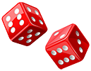

# Yamb 

Yamb popularna igra kockicama. Cilj igre je dobiti što više poena bacanjem kockica, pri čemu se dobijaju različite kombinacije, od kojih svaka nosi određen broj poena. Igra je nastala proširivanjem igre _Yahtzee_, a koja je nastala sredinom prošlog veka.

# Korišćene biblioteke
* Qt 5.15
* Boost >= 1.67

# Instalacija potrebnih biblioteka
## Qt i Qt Creator
1. `$ sudo apt install qtcreator`
2. `$ sudo apt install build-essential`
3. `$ sudo apt install qt5-default`
4. `$ sudo apt install qtmultimedia5-dev`

## Boost
_Vrlo je važno da verzija Boost biblioteke bude bar 1.67. Ukoliko operativni sistem nije ažuriran, postoji mogućnost da naredne komande ne instaliraju potrebnu verziju. U tom slučaju je Boost potrebno instalirati ručno sa naredne [adrese](https://www.boost.org/users/download/)._
1. `$ sudo add-apt-repository ppa:mhier/libboost-latest`
2. `$ sudo apt update`
3. `$ sudo apt install libboost1.67-dev`
4. `$ sudo apt install libasio-dev`

# Pokretanje servera
_Trenutna implementacija pristupa serveru koji se nalazi na udaljenoj IP adresi i nema potrebe za eksplicitnim pokretanjem servera._

## Build-ovanjem izvornog koda
1. `$ cd 14-jamb/code/NetworkServer`
2. `$ cmake CMAkeLists.txt`
3. `$ ./server`

## Build-ovanjem Docker fajla
1. `$ cd code/`
2. `$ docker build -t yamb-server .`
3. `$ docker run yamb-server`

# Pokretanje igre
## Build-ovanjem izvornog koda
1. U Qt Creator-u otvoriti `14-jamb/code/Yamb/Yamb.pro`.
2. Pritisnuti dugme **Run** u donjem levom uglu ili `Ctrl + R` na tastaturi.

# Upustvo za korišćenje
## Pravljenje nove partije
1. Na početnom ekranu odabrati opciju **Create game**.
2. Odabrati opciju **Multiplayer**.
3. Poslati identifikator partije protivniku.

## Povezivanje na postojeću partiju
1. Na početnom ekranu odabrati opciju **Join game**.
2. Upisati idenfikator partije u prostor predviđen za to.
3. Pristinuti dugme **Join**.

## Pravila igre
- Pravila igre Yamb se mogu pronaći na sledećoj [adresi](https://sr.wikipedia.org/wiki/%D0%88%D0%B0%D0%BC%D0%B1_(%D0%B8%D0%B3%D1%80%D0%B0)). 
- U postojećoj implementaciji nije moguće poništiti najavu niti promeniti najavljeno polje.

# Demo snimak
Na narednoj [adresi](https://www.youtube.com/playlist?list=PL373ZGQC2ViwBjsUIFB1rJ3NFblanNOR3) se nalazi YouTube plejlista sa dva snimka na kojima igrači igraju jedan protiv drugog.

# Licence za dodatne resurse
- Slike su autorske i ne podležu bilo kakvoj licenci.
- Zvukovi su preuzeti sa sajta [freesound](https://freesound.org/) pod CC licencom.

# Developers
- [Jovan Rumenić, 69/2017](https://gitlab.com/rumeni1)
- [David Nestorović, 162/2017](https://gitlab.com/dnestorovic)
- [Momčilo Knežević, 189/2017](https://gitlab.com/momciloknezevic7)
- [Stefan Marjanović, 141/2017](https://gitlab.com/sm998)
- [Kosta Grujčić, 12/2017](https://gitlab.com/4eyes4u)
